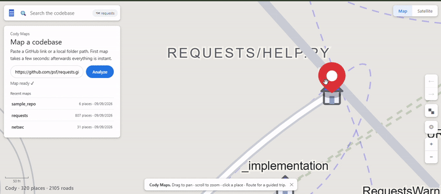

# Cody Maps 🗺️ — Google Maps for your codebase

[](LICENSE)
[](requirements.txt)
[](CHANGELOG.md)

> **Paste any Python repo link or local folder. Get an interactive map of its
> code — neighborhoods, highways, guided trips, plain-English explanations.**
> Fully offline via local Ollama. Your code never leaves your laptop.


*Rendered from real engine output on `psf/requests` (807 places analyzed,
320 shown). A recorded capture of the live UI can replace this file 1:1.*

---

## Scope: Python-first, honestly

| Language | Analysis quality |
|---|---|
| **Python** | Full Tree-sitter AST: functions, classes, imports (incl. aliases + relative), 5-tier call resolution, callback/thread detection |
| Everything else (JS/TS/Go/Rust/Java/…) | Best-effort regex fallback — map renders, accuracy not guaranteed |

If your repo is Python, Cody is the whole product. Other languages are
"look around" mode until their parsers land (see Roadmap).

## Features

- **Force-directed city map** — connected functions pull together; files get
  dashed neighborhood outlines + floating labels; top hubs become yellow
  highways; long teleport-roads stay hidden until you select a place.
- **Houses, not dots** — functions are houses, classes are tower blocks,
  external libraries live on their own island across the water.
- **Guided trips** — Route turns the real BFS walkthrough into a blue-line
  journey with numbered stops and a riding traveler dot; every stop opens its
  full explanation card + Q&A.
- **Place cards** — Overview (AI explanation + callers/callees chips) / Code
  (syntax-highlighted) / Q&A (grounded chat about that function) + Route,
  Nearby, Ask, Copy actions.
- **Search autocomplete**, **Map/Satellite themes**, **layers menu**
  (libraries, labels, tests/examples, minimap), **draggable minimap inset**
  with viewport box + click-to-travel, **back/forward place history**,
  file-tree-aware file outlines, scale bar, `/` shortcut.
- **Offline-first AI** — explanations + chat via local Ollama
  (`qwen2.5-coder:3b`); proxy-proof client, failures never cached, map and
  search work with no AI at all.
- **Multi-repo store** — analyze many repos, switch between recent maps,
  async jobs with live progress, per-repo SQLite persistence.

## Quickstart

```bash
# 1. AI brain (optional but recommended; map works without it)
ollama serve
ollama pull qwen2.5-coder:3b

# 2. Cody
pip install -r requirements.txt
python main.py https://github.com/psf/requests.git   # or: python main.py .
```

Opens `http://127.0.0.1:5000`. Search (`/`), click a house, hit **Route**.

```bash
python main.py --help            # . | <git-url> | --port | --no-browser | --analyze-only
CODY_MODEL=qwen2.5-coder:7b python main.py .
```

### Docker

```bash
docker build -t cody:1.0.0 .
docker run -p 5000:5000 -e OLLAMA_HOST=http://host.docker.internal:11434 cody:1.0.0
```

> Inside a container `127.0.0.1` is the container, not your laptop —
> `OLLAMA_HOST` must point back at the host.

### VS Code extension (`vscode-extension/`, v0.1.0)

Sidebar with hotspots + files, search-to-definition, full map panel.
Open this repo in VS Code, press **F5**, open any Python folder in the new
window. Details + `.vsix` packaging in [`vscode-extension/README.md`](vscode-extension/README.md).

## Configuration (env vars)

| Var | Default | What |
|---|---|---|
| `CODY_DB` | `cody.db` | SQLite store location |
| `CODY_REPO_DIR` | `cloned_repo` | Where git URLs get cloned |
| `CODY_MODEL` | `qwen2.5-coder:3b` | Ollama model for explanations/chat |
| `OLLAMA_HOST` | `http://127.0.0.1:11434` | Ollama server (must include `:11434`) |
| `HOST` / `PORT` | `127.0.0.1` / `5000` | Server bind |

## API (for scripting)

`POST /api/analyze {"source": "<git-url|local-path>"}` → `{job_id}` (poll
`GET /api/analyze/status?job_id=`) · `GET /api/repos` · `GET /api/graph` ·
`GET /api/search?q=` · `GET /api/files` · `GET /api/node/relations?node_id=` ·
`GET /api/node/explain?node_id=` (cached) · `POST /api/chat` ·
`GET /api/hotspots` · `GET /api/walkthrough` · `GET /api/health` (Ollama +
proxy diagnostics + version).

## Project structure

```
Cody/
├── cody/
│   ├── analyzer.py     # two-pass analysis: symbols → edges (+Ollama client)
│   ├── parser.py       # Tree-sitter parsing + Python import resolution
│   ├── database.py     # multi-repo SQLite, search/relations, expl. cache
│   ├── app.py          # Flask API (async jobs, health diagnostics)
│   ├── templates/index.html   # Maps chrome + place/trip/analyze panels
│   └── static/{css,js}/       # island map: force layout, roads, minimap
├── main.py             # CLI: cody . | <url> [--port/--no-browser/...]
├── tests/              # 15 pytest cases (no Ollama needed)
├── vscode-extension/   # sidebar + search + map panel for VS Code
├── mockup/             # UI design mockups that became the app
├── Dockerfile / .dockerignore
├── CHANGELOG.md / LICENSE (MIT)
└── Cody_Research_Document.*    # background research papers
```

## Testing

```bash
py -m pytest tests/ -q        # 15 passed: golden repo, multi-repo isolation,
                              # proxy-immunity, identity pinning, error-cache
node --check cody/static/js/app.js
```

## Troubleshooting

| Symptom | Fix |
|---|---|
| AI says proxy-504 / gateway HTML | Open `http://127.0.0.1:5000` **with** `:5000`; set Windows proxy bypass for `127.0.0.1,localhost`; check `/api/health` |
| `ollama_ok: false` in `/api/health` | `ollama serve` + `ollama pull qwen2.5-coder:3b`; check `OLLAMA_HOST` includes `:11434` |
| Port already in use | A stale server survived — kill old `python` processes, restart once |
| Empty map after Analyze | Wait for indexing (~6s per 1k functions), refresh; check job status |
| Explanation shows old error text | Hard-refresh (`Ctrl+Shift+R`); stale caches auto-purge on boot |

## Recording the demo (maintainers)

30 seconds, `requests` repo: analyze → search `get` → open place card →
**Route** → traveler rides the blue line → one **Ask** with a real answer.
Keep under 10MB, save as `docs/demo.gif`, keep this README's image link.

## Roadmap (v1.1+)

- Repo briefing card ("explain this whole codebase in 30 seconds")
- Repo briefing card ("explain this whole codebase in 30 seconds")
- `pip install cody-maps` (PyPI) · VS Code Marketplace publish · live demo
- More Tree-sitter languages to full support · graph diff across branches

## Contributing

Issues with **steps + expected + actual + `/api/health` output** get triaged
first. Every bugfix ships with a test that fails before and passes after.
`py -m pytest tests/ -q` must stay green.

## License

MIT — see [LICENSE](LICENSE). Author: Sahil Gupta.
